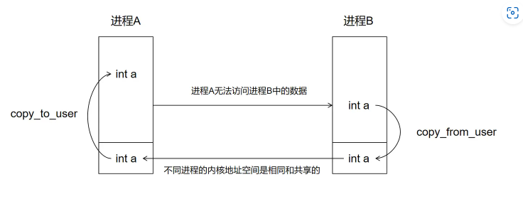
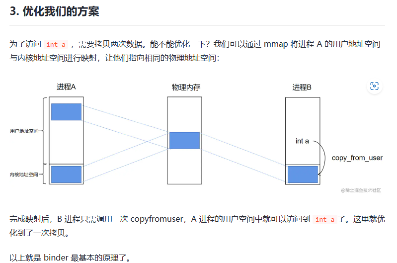

[写给应用开发的 Android Framework 教程——学穿 Binder 篇之 Binder 基本原理 - 掘金 (juejin.cn)](https://juejin.cn/post/7210175991837392933)

### C示例

https://github.com/ahaoddu/BinderCDemo.git

---

# Binder 线程数量限制和保护机制

在 Android 系统中，`system_server` 是核心的服务进程之一，负责启动和管理大多数系统级服务（如 ActivityManagerService、WindowManagerService、PowerManagerService 等）。它通过 Binder IPC（进程间通信）机制与其他进程进行通信。Binder 线程的数量限制及其保护机制，直接影响到系统的稳定性和性能。

### 1. Binder 线程数量限制

在 Android 中，`system_server` 对 Binder 线程的数量是有限制的，这个限制通常与系统配置和资源（如 CPU、内存）有关。Binder 线程主要用于处理来自其他进程的请求。每个请求都会分配一个 Binder 线程来处理。

Android 通过一个线程池管理 Binder 请求，这个线程池的最大线程数默认情况下是 **16** 个线程。这个线程池的大小是在 Android 的源代码中硬编码的，但是可以根据实际的需求进行调整，通常可以通过修改一些系统配置来增加线程池的大小。

### 2. Binder 线程池的保护机制

当 Binder 线程池中的线程达到最大限制时，系统会采取以下措施来保护系统不被过度消耗资源：

#### 1) **请求排队**

当所有 Binder 线程都在工作时，新的 Binder 请求不会被立刻处理，而是会被排队等待。这个排队的机制可以有效避免系统在高负载下崩溃，但过多的排队请求会导致延迟增大，从而影响系统的响应性。

#### 2) **优先级调度**

Android 会对 Binder 线程进行调度，优先处理一些关键服务的请求。例如，与核心系统服务（如窗口管理、权限管理等）相关的请求可能会优先处理，而一些低优先级的请求会被延迟执行。这种调度机制可以避免高优先级请求被低优先级请求阻塞。

#### 3) **线程池扩展**

如果在某些特殊场景下，系统会根据负载自动增加 Binder 线程池的大小，但这个扩展是有限制的，不能无限制地增加线程池的大小。扩展过程中，系统会监控资源的使用情况，以避免内存或 CPU 的过度消耗。

#### 4) **超时机制**

如果某个 Binder 请求在特定时间内没有得到处理，系统会触发超时机制，返回错误响应给请求方。这样可以避免请求长时间阻塞，导致整个系统性能下降。

#### 5) **异常处理**

如果系统检测到线程池已满且无法处理请求，或者有线程处理过慢、卡死的情况，可能会触发异常处理机制。最严重的情况下，Android 会终止并重启部分服务，避免系统进入不可用状态。

#### 6) **系统资源保护**

在 Binder 线程池达到最大线程数的情况下，Android 会更加小心地使用系统资源，防止系统因资源耗尽（如内存或 CPU）而变得不稳定。如果系统负载过高，Android 还可能采取其他保护措施，例如降低后台进程的优先级，或终止一些不重要的进程。

### 3. 配置和调优

在一些 Android 系统的定制化版本中，开发者可以调整系统的 Binder 线程池大小及其相关参数。通过修改相关的配置文件或源代码，开发者可以在 `system_server` 启动时调整 Binder 线程池的大小。例如，修改 `binder_thread_pool` 配置或在 C++ 层进行修改（如在 `binder.cpp` 中调整）。

通常来说，这些配置在高负载场景下或者需要更高并发的系统中会有所调整。

### 4. 总结

- **Binder 线程池的大小**：在默认情况下，`system_server` 支持的最大 Binder 线程数为 **16**，但是这个值是可以通过系统配置进行调整的。
- **保护措施**：当 Binder 线程池已满时，Android 会采用请求排队、优先级调度、线程池扩展等方式进行保护，避免系统崩溃或性能严重下降。
- **系统监控**：Android 会监控系统的资源使用情况，采取适当的保护措施，如超时机制、异常处理等，确保系统的稳定性和响应性。

如果你需要在特定场景下优化 Binder 线程池，建议了解更多关于系统的线程管理和负载均衡的实现，或者根据需求修改系统的源码和配置。