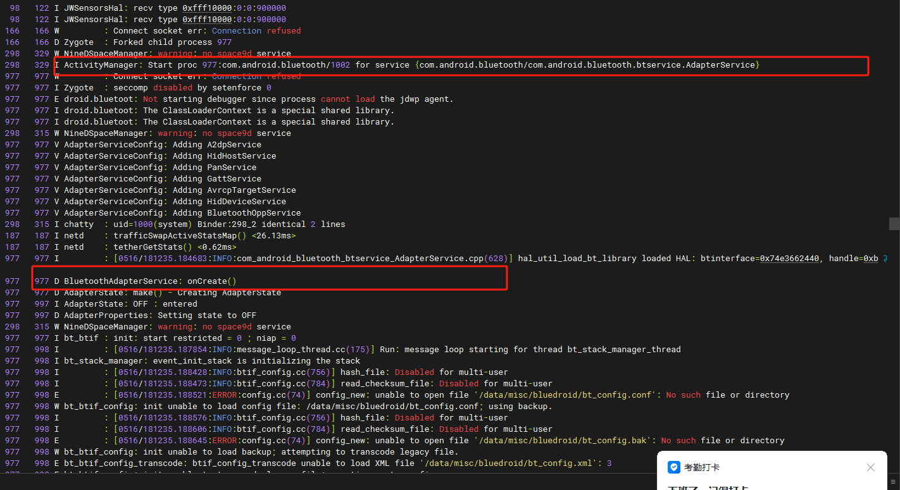

[
](https://blog.csdn.net/qq_25370227/category_12524610.html)

[
](https://blog.csdn.net/qq_25370227/category_12524610.html)

[
](https://blog.csdn.net/qq_25370227/category_12524610.html)

* [android蓝牙协议栈 fluoride_小小鸟飞呀飞的博客-CSDN博客](https://blog.csdn.net/qq_25370227/category_12524610.html)
* [蓝牙  |  Android 开源项目  |  Android Open Source Project](https://source.android.com/docs/core/bluetooth?hl=zh-cn)
* [android.bluetooth  |  Android Developers](https://developer.android.com/reference/android/bluetooth/package-summary)

frameworks/base/core/java/com/android/internal/space/api/BluetoothMock.java

在AOSP中，蓝牙相关的代码和接口主要位于 `system/bt`目录下[^1^](https://source.android.google.cn/docs/core/connect/bluetooth/services?hl=zh-cn)[。这个目录包含了实现Android蓝牙功能的所有源代码](https://source.android.google.cn/docs/core/connect/bluetooth/services?hl=zh-cn)[^1^](https://source.android.google.cn/docs/core/connect/bluetooth/services?hl=zh-cn)。

[如果你想要模拟蓝牙信息，你可能需要查看 `include/hardware/bluetooth.h`文件](https://source.android.google.cn/docs/core/connect/bluetooth/services?hl=zh-cn)[^1^](https://source.android.google.cn/docs/core/connect/bluetooth/services?hl=zh-cn)[。这个文件包含了用于不同服务的蓝牙配置文件](https://source.android.google.cn/docs/core/connect/bluetooth/services?hl=zh-cn)[^1^](https://source.android.google.cn/docs/core/connect/bluetooth/services?hl=zh-cn)。

[此外，你可能还需要查看 `packages/apps/Bluetooth`目录，这个目录包含了Android蓝牙应用的源代码](https://source.android.google.cn/docs/core/connect/bluetooth/services?hl=zh-cn)[^1^](https://source.android.google.cn/docs/core/connect/bluetooth/services?hl=zh-cn)。

[请注意，修改这些代码可能需要一定的Android和蓝牙开发知识。如果你在修改过程中遇到问题，你可以在相关的开发者论坛上寻求帮助](https://source.android.google.cn/docs/core/connect/bluetooth/services?hl=zh-cn)[^1^](https://source.android.google.cn/docs/core/connect/bluetooth/services?hl=zh-cn)。希望这些信息对你有所帮助！

./packages/apps/Bluetooth

packages/services/Telecomm/src/com/android/server/telecom/bluetooth

system/bt/osi/src/alarm.cc

frameworks/base/core/java/android/bluetooth

### 报错分析

Zygote  : seccomp disabled by setenforce 0
05-13 10:45:42.373 28798 28798 E droid.bluetoot: Not starting debugger since process cannot load the jdwp agent.可能是什么意思？

Copilot

正在为你生成答案…

这两条日志信息分别表示：

1. [ **Zygote : seccomp disabled by setenforce 0** ：这条信息表示 `seccomp`（一个Linux内核特性，用于限制进程可以调用的系统调用）被禁用了](https://blog.csdn.net/zhangtengyuan23/article/details/78478969)[^1^](https://blog.csdn.net/zhangtengyuan23/article/details/78478969)[。`setenforce 0`是一个命令，用于将SELinux（一个用于提供访问控制安全策略的Linux内核模块）设置为宽松模式](https://blog.csdn.net/zhangtengyuan23/article/details/78478969)[^2^](https://stackoverflow.com/questions/30998343/how-to-set-selinux-to-0-or-permissive-mode-in-android-4-4-4-and-above)[。在这种模式下，SELinux会允许所有操作，但会记录哪些操作会在强制模式下被拒绝](https://blog.csdn.net/zhangtengyuan23/article/details/78478969)[^2^](https://stackoverflow.com/questions/30998343/how-to-set-selinux-to-0-or-permissive-mode-in-android-4-4-4-and-above)[。这通常用于调试](https://stackoverflow.com/questions/30998343/how-to-set-selinux-to-0-or-permissive-mode-in-android-4-4-4-and-above)[^2^](https://stackoverflow.com/questions/30998343/how-to-set-selinux-to-0-or-permissive-mode-in-android-4-4-4-and-above)。
2. [ **05-13 10:45:42.373 28798 28798 E droid.bluetoot: Not starting debugger since process cannot load the jdwp agent** ：这条信息表示 `droid.bluetooth`进程无法加载JDWP（Java Debug Wire Protocol，Java调试线协议）代理，因此调试器无法启动。JDWP代理是用于处理调试请求和管理调试资源的](https://blog.csdn.net/lijie2664989/article/details/109689067)[^3^](https://blog.csdn.net/lijie2664989/article/details/109689067)。

[这些信息可能表明你的应用或设备正在调试模式下运行，但由于某些原因（如安全策略或配置错误），调试器无法正常启动](https://blog.csdn.net/lijie2664989/article/details/109689067)[^3^](https://blog.csdn.net/lijie2664989/article/details/109689067)。希望这些信息对你有所帮助！

### 报错


### 别触发蓝牙栈启用

```java
@RequiresPermission(Manifest.permission.BLUETOOTH)
    @ScanMode
    public int getScanMode() {
        if (getState() != STATE_ON) {
            return SCAN_MODE_NONE;
        }
        try {
            mServiceLock.readLock().lock();
            if (mService != null) {
                return mService.getScanMode();
            }
        } catch (RemoteException e) {
            Log.e(TAG, "", e);
        } finally {
            mServiceLock.readLock().unlock();
        }
        return SCAN_MODE_NONE;
    }
```

1. **检查蓝牙状态** ：首先，函数通过调用 `getState()`方法来获取当前蓝牙设备的状态。如果蓝牙设备的状态不是 `STATE_ON`（即蓝牙设备没有打开），那么函数就会返回 `SCAN_MODE_NONE`。
2. **获取蓝牙服务** ：然后，函数尝试获取一个读锁，以便安全地访问蓝牙服务。如果蓝牙服务存在（`mService != null`），那么函数就会调用蓝牙服务的 `getScanMode()`方法来获取当前的扫描模式。
3. **处理异常** ：如果在访问蓝牙服务时发生了 `RemoteException`，那么函数就会捕获这个异常，并使用 `Log.e`方法来记录这个异常。
4. **释放读锁** ：最后，无论是否成功获取了扫描模式，函数都会释放读锁。
5. **返回扫描模式** ：如果函数能够成功获取扫描模式，那么它就会返回这个扫描模式。否则，它会返回 `SCAN_MODE_NONE`。

frameworks/base/core/java/android/bluetooth/BluetoothAdapter.java

frameworks/base/core/java/android/bluetooth/BluetoothInputStream.java

    这个枚举类型包含了7个值，分别对应蓝牙适配器的7种状态：

1. **STATE_OFF** ：这个状态表示蓝牙适配器当前处于关闭状态。
2. **STATE_TURNING_ON** ：这个状态表示蓝牙适配器正在打开。
3. **STATE_ON** ：这个状态表示蓝牙适配器已经打开。
4. **STATE_TURNING_OFF** ：这个状态表示蓝牙适配器正在关闭。
5. **STATE_BLE_TURNING_ON** ：这个状态表示低功耗蓝牙（Bluetooth Low Energy，BLE）正在打开。
6. **STATE_BLE_ON** ：这个状态表示低功耗蓝牙已经打开。
7. **STATE_BLE_TURNING_OFF** ：这个状态表示低功耗蓝牙正在关闭。

这些状态可以帮助应用程序了解蓝牙适配器的当前状态，从而做出相应的操作。希望这些信息对你有所帮助！

1. **`SCAN_MODE_NONE`** ：

* **解释** ：设备不进行扫描，不对外广播自身，也无法被其他设备发现或连接。
* **用途** ：用于节省电量或隐私保护。当设备处于这种模式时，它不会主动向外发送任何信号，也不会响应其他设备的连接请求。

1. **`SCAN_MODE_CONNECTABLE`** ：

* **解释** ：设备处于可连接状态，但不可发现。设备不会主动广播其存在信息，但可以接受连接请求。
* **用途** ：用于设备在已知连接的情况下继续保持连接能力。例如，一些设备可以在这种模式下由已配对的设备连接，而无需被新的设备发现。

1. **`SCAN_MODE_CONNECTABLE_DISCOVERABLE`** ：

* **解释** ：设备处于既可连接又可发现的状态。设备会广播其存在信息，并接受新的连接请求。
* **用途** ：用于设备希望被新的设备发现并建立连接的场景。比如，在初次配对或设备配对模式下，设备通常处于这种模式，使其能够被其他设备扫描到并请求连接。



---

frameworks/base/core/java/android/bluetooth

packages/apps/Bluetooth

hardware/interfaces/bluetooth

hardware/qcom/bt

hardware/libhardware/include/hardware/bluetooth.h

---

system/bt/osi/src/alarm.cc

system/bt/btif/src/btif_config.cc

system/bt/binder/android/bluetooth/IBluetoothManager.aidl

frameworks/base/services/core/java/com/android/server/BluetoothService.java

frameworks/base/services/core/java/com/android/server/BluetoothManagerService.java

IBluetoothManager managerService

IBluetoothmService mService

    [在Android的蓝牙模块中，`IBluetoothManager`和 `IBluetooth`是两个重要的接口](https://blog.csdn.net/DamonMasty/article/details/130596792)[^1^](https://blog.csdn.net/DamonMasty/article/details/130596792)[。他们在 `/frameworks/base/core/java/android/bluetooth/`路径下定义](https://blog.csdn.net/DamonMasty/article/details/130596792)[^1^](https://blog.csdn.net/DamonMasty/article/details/130596792)。

* [`IBluetoothManager`：这是一个AIDL接口，它在获取 `BluetoothAdapter`的过程中作为AIDL的客户端初始化](https://blog.csdn.net/DamonMasty/article/details/130596792)[^1^](https://blog.csdn.net/DamonMasty/article/details/130596792)[。它负责接收其他模块的蓝牙交互请求，大部分能力来自 `IBluetooth.aidl`](https://blog.csdn.net/DamonMasty/article/details/130596792)[^1^](https://blog.csdn.net/DamonMasty/article/details/130596792)[。在 `BluetoothAdapter.java`中，通过获取挂在系统服务里的 `BluetoothManagerService`的 `IBinder`服务，然后 `asInterface`成客户端](https://blog.csdn.net/DamonMasty/article/details/130596792)[^1^](https://blog.csdn.net/DamonMasty/article/details/130596792)[。`BluetoothManagerService`在蓝牙系统服务引导过程中被运行起来，作为 `IBinder`服务端初始化并被系统服务集统一管理起来](https://blog.csdn.net/DamonMasty/article/details/130596792)[^1^](https://blog.csdn.net/DamonMasty/article/details/130596792)。
* [`IBluetooth`：这也是一个AIDL接口，它主要用于控制蓝牙模块，例如开启扫描/停止扫描，设置蓝牙模块对外名称，操纵远程蓝牙设备，例如向远程设备发起配对过程](https://blog.csdn.net/DamonMasty/article/details/130596792)[^1^](https://blog.csdn.net/DamonMasty/article/details/130596792)[。在 `BluetoothAdapter.java`中，`mService`是链接 `bluetooth.apk`的服务](https://blog.csdn.net/DamonMasty/article/details/130596792)[^2^](https://blog.csdn.net/yudelian/article/details/126247233)[。`BluetoothAdapter`与 `BluetoothManagerService.java`建立联系，注册回调](https://blog.csdn.net/DamonMasty/article/details/130596792)[^2^](https://blog.csdn.net/yudelian/article/details/126247233)。

总的来说，`IBluetoothManager`主要负责管理蓝牙服务，而 `IBluetooth`则主要负责执行具体的蓝牙操作。希望这个解释对你有所帮助！

`IBluetooth`接口与蓝牙堆栈直接交互。它提供了一组方法，这些方法允许应用程序执行各种蓝牙操作，如扫描、配对和连接设备等。这些操作会直接与底层的蓝牙堆栈交互来执行。因此，我们可以说 `IBluetooth`是应用程序和蓝牙堆栈之间的桥梁。希望这个解释对你有所帮助！


在AOSP中，从Framework层禁用蓝牙模块可以通过修改代码和配置来实现。以下是禁用蓝牙模块的一些方法：

### 方法一：修改配置文件

1. **修改 `frameworks/base` 目录下的配置文件**：

   - 打开 `frameworks/base/core/res/res/values/config.xml` 文件。
   - 查找 `config_bluetooth_enabled` 属性，将其值设置为 `false`。

     ```xml
     <!-- Enable or disable Bluetooth -->
     <bool name="config_bluetooth_enabled">false</bool>
     ```
2. **修改 `device/<vendor>/<device>` 目录下的 `BoardConfig.mk` 文件**：

   - 添加或修改以下行以禁用蓝牙：

     ```makefile
     BOARD_HAVE_BLUETOOTH := false
     ```

### 方法二：修改蓝牙服务的启动

1. **修改 `frameworks/base/services/java/com/android/server/SystemServer.java`**：

   - 查找并注释掉与蓝牙服务相关的代码：

     ```java
     import com.android.server.BluetoothManagerService; // 注释掉这一行

     // 注释掉与启动蓝牙服务相关的代码
     if (context.getPackageManager().hasSystemFeature(PackageManager.FEATURE_BLUETOOTH)) {
         // mSystemServiceManager.startService(BluetoothManagerService.Lifecycle.class);
     }
     ```
2. **修改 `frameworks/base/packages/SettingsProvider/res/values/defaults.xml` 文件**：

   - 找到 `bluetooth_on` 属性，将其值设置为 `0`。

     ```xml
     <!-- Default value for whether Bluetooth is on or off -->
     <integer name="bluetooth_on">0</integer>
     ```

### 方法三：修改蓝牙相关的Manifest文件

1. **修改 `frameworks/base/core/res/AndroidManifest.xml`**：
   - 查找并注释掉或删除与蓝牙相关的 `uses-feature` 和 `uses-permission` 标签。

     ```xml
     <!-- 注释掉与蓝牙相关的 uses-feature 标签 -->
     <!-- <uses-feature android:name="android.hardware.bluetooth" android:required="false" /> -->
     <!-- <uses-feature android:name="android.hardware.bluetooth_le" android:required="false" /> -->

     <!-- 注释掉与蓝牙相关的 uses-permission 标签 -->
     <!-- <uses-permission android:name="android.permission.BLUETOOTH" /> -->
     <!-- <uses-permission android:name="android.permission.BLUETOOTH_ADMIN" /> -->
     ```

### 方法四：禁用蓝牙HAL

1. **修改 `device/<vendor>/<device>/bluetooth` 目录下的 `bluetooth.mk` 文件**：
   - 注释掉或删除加载蓝牙HAL模块的代码。

     ```makefile
     # Comment out or remove the following lines
     # PRODUCT_PACKAGES += \
     #     android.hardware.bluetooth@1.0-service
     ```

### 方法五：从编译中移除蓝牙

1. **修改 `device/<vendor>/<device>/device.mk` 文件**：
   - 删除与蓝牙相关的模块。

     ```makefile
     # Comment out or remove the following lines
     # PRODUCT_PACKAGES += \
     #     Bluetooth \
     #     BluetoothExt
     ```

通过以上方法，可以在AOSP中禁用蓝牙模块。如果需要进一步禁用或定制蓝牙功能，可以根据项目需求进行更深入的修改。


---


在AOSP的构建过程中，`PRODUCT_PACKAGES` 列表中包含了很多默认构建的包，其中一些可能与蓝牙有关。让我们逐一分析你提供的这些包是否与蓝牙相关，以及是否需要删除它们以禁用蓝牙功能：

1. **audio.a2dp.default**:

   - 这个包是默认的A2DP（高级音频分配协议）音频HAL（硬件抽象层）实现，主要用于通过蓝牙传输音频。
   - **与蓝牙有关，需要删除。**
2. **audio.usb.default**:

   - 这个包是默认的USB音频HAL实现，主要用于通过USB传输音频。
   - **与蓝牙无关，不需要删除。**
3. **audio.r_submix.default**:

   - 这个包是默认的远程子混音（Remote Submix）音频HAL实现，主要用于远程音频流。
   - **与蓝牙无关，不需要删除。**
4. **tinyplay**:

   - 这个工具是一个简单的音频播放工具，用于播放音频文件。
   - **与蓝牙无关，不需要删除。**

因此，要禁用蓝牙功能，您需要从 `PRODUCT_PACKAGES` 列表中删除 `audio.a2dp.default` 包。

修改后的配置如下：

```makefile
# Build default audio HALs
PRODUCT_PACKAGES += audio.usb.default \
		    audio.r_submix.default \
		    tinyplay
```

### 总结

删除 `audio.a2dp.default` 可以帮助禁用蓝牙A2DP功能，进一步确保蓝牙模块被禁用。之后，重新编译并刷入设备以验证更改。
