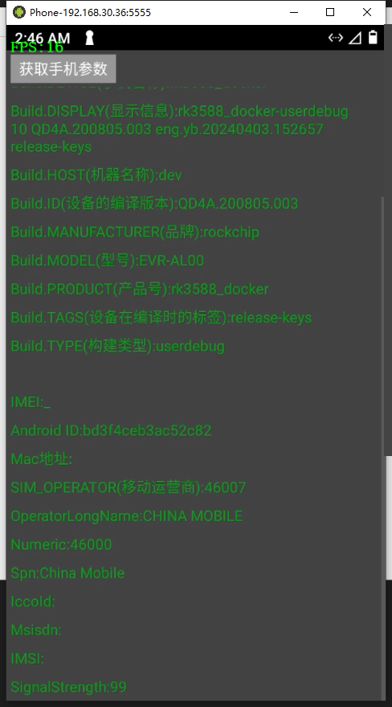
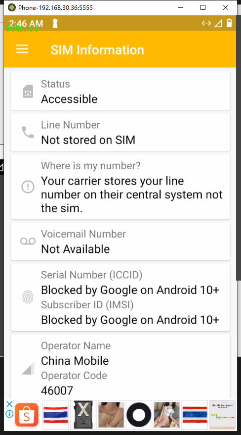
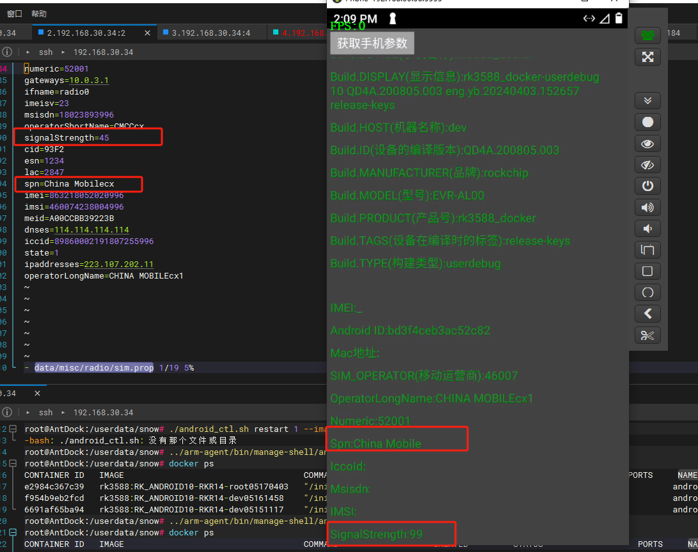
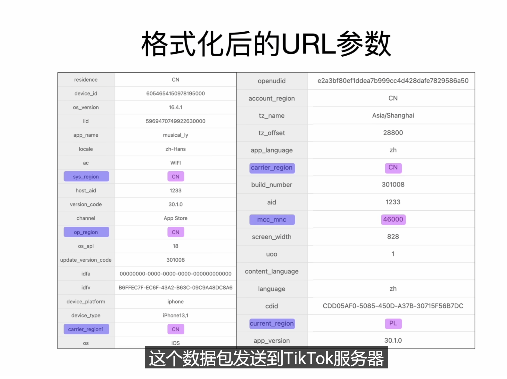
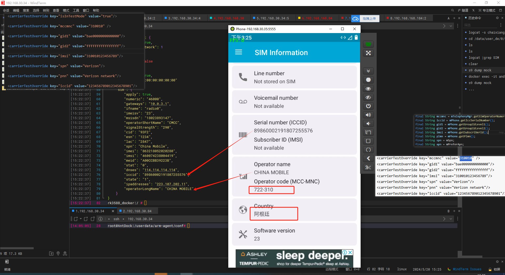
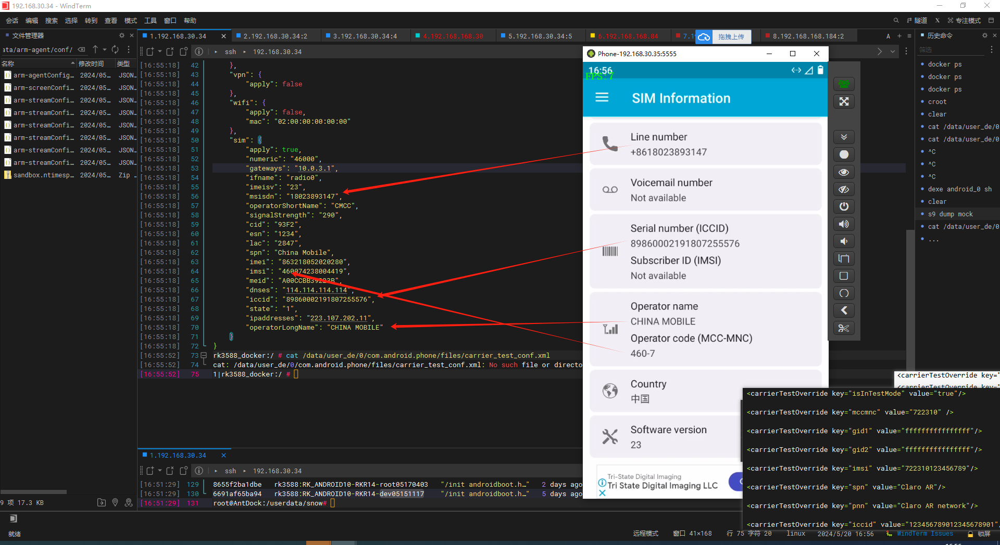

- sim卡拔掉
- 语言
- 外网环境

### SIM






##### after



data/misc/radio/sim.prop

[对于泰国的AIS手机卡，`operatorShortName`和 `operatorLongName`通常代表运营商的简称和全称。对于AIS，这些值可能是&#34;AIS&#34;和&#34;Advanced Info Service&#34;。然而，这些值可能会根据具体的手机卡和服务套餐有所不同](https://zhuanlan.zhihu.com/p/678301132)[^1^](https://zhuanlan.zhihu.com/p/678301132)[^2^](https://zh.wikipedia.org/wiki/AIS%E9%80%9A%E4%BF%A1)。

`spn`（Service Provider Name）通常是运营商为其服务设定的名称。对于AIS，这个值可能就是"AIS"。

`numeric`是一个标识符，用于唯一标识移动网络运营商。每个国家和地区的运营商都有一个唯一的 `numeric`值。对于泰国的AIS，这个值可能是"52001"，但这个值可能会根据具体的网络和地区有所不同。

### 要求

1. 运营商
2. 关闭root
3. 时区和语言
4. sim
5. 24小时制

persist.sys.timezone=Asia/Shanghai

当前任务

1. 51的那几个参数
2. url的哪些参数

---

1.晚点给个美国千粉号，
2.网络需要美国家庭IP
3.导入sim卡信息。
4.打开定位，跟据IP修改定位信息。
5.做通讯录假数据，拒绝通讯录会导致权重下载。
6.读取该地区App列表，要安装一些常用App。

时区/语言

[android 国外运营商 安卓伪装国外运营商_mob6454cc6f6c1c的技术博客_51CTO博客](https://blog.51cto.com/u_16099263/8456579)



./java/android/telephony/TelephonyManager.java:10281:                        getSubId(), mccmnc, imsi, iccid, gid1, gid2, plmn, spn,

/system/etc/apns-conf.xml

/system/etc/spn-conf.xml

这些数据库文件在安卓系统中分别存储不同类型的信息。以下是每个数据库文件的简要说明：

### 1. `./vendor/radio/qcril_database/qcril.db`

这个数据库与高通的QCRIL（Qualcomm Radio Interface Layer）有关，通常用于存储无线电模块相关的数据。具体来说，它可能包含以下信息：

* 网络配置和状态
* 运营商特定配置
* SIM卡信息
* 无线电参数和状态

### 2. `./system/etc/hips.db`

`hips.db`的具体用途取决于设备制造商和系统版本。在某些情况下，它可能与系统安全配置或策略相关。HIPS（Host Intrusion Prevention System）通常用于检测和预防系统入侵，因此这个数据库可能包含与安全策略、访问控制和防护机制相关的数据。

### 3. `./storage/emulated/0/Android/data/.com.meizu.filemanager/.garbage/.garbage.db`

这个数据库与魅族文件管理器有关，`.garbage.db`通常用于存储文件管理器的临时数据或缓存数据，例如：

* 已删除文件的记录
* 垃圾文件信息
* 临时文件和缓存

### 4. `./storage/emulated/0/Android/data/Gallery_local/galleryEx.db`

这个数据库与本地图库应用有关，通常用于存储图库应用的扩展信息，例如：

* 图片和视频的元数据
* 用户收藏和相册信息
* 标签和分类

### 5. `./storage/emulated/0/amap/openamaplocationsdk/alsn20170807.db`

这个数据库与高德地图（Amap）的开放位置SDK有关，通常用于存储位置相关的数据，例如：

* 用户位置信息
* 位置信息缓存
* 地图和导航数据

/[frameworks](http://aospxref.com/android-10.0.0_r47/xref/frameworks/)/[opt](http://aospxref.com/android-10.0.0_r47/xref/frameworks/opt/)/[telephony](http://aospxref.com/android-10.0.0_r47/xref/frameworks/opt/telephony/)/[src](http://aospxref.com/android-10.0.0_r47/xref/frameworks/opt/telephony/src/)/[java](http://aospxref.com/android-10.0.0_r47/xref/frameworks/opt/telephony/src/java/)/[com](http://aospxref.com/android-10.0.0_r47/xref/frameworks/opt/telephony/src/java/com/)/[android](http://aospxref.com/android-10.0.0_r47/xref/frameworks/opt/telephony/src/java/com/android/)/[internal](http://aospxref.com/android-10.0.0_r47/xref/frameworks/opt/telephony/src/java/com/android/internal/)/[telephony](http://aospxref.com/android-10.0.0_r47/xref/frameworks/opt/telephony/src/java/com/android/internal/telephony/)/[CarrierResolver.java](http://aospxref.com/android-10.0.0_r47/xref/frameworks/opt/telephony/src/java/com/android/internal/telephony/CarrierResolver.java)

```java
709      private CarrierMatchingRule getSubscriptionMatchingRule() {
710          final String mccmnc = mTelephonyMgr.getSimOperatorNumericForPhone(mPhone.getPhoneId());//TelephonyManager
711          final String iccid = mPhone.getIccSerialNumber();//Phone
712          final String gid1 = mPhone.getGroupIdLevel1();
713          final String gid2 = mPhone.getGroupIdLevel2();
714          final String imsi = mPhone.getSubscriberId();
715          final String plmn = mPhone.getPlmn();
716          final String spn = mSpn;
717          final String apn = mPreferApn;
718          List<String> accessRules;
719          // check if test override present
720          if (!TextUtils.isEmpty(mTestOverrideCarrierPriviledgeRule)) {
721              accessRules = new ArrayList<>(Arrays.asList(mTestOverrideCarrierPriviledgeRule));
722          } else {
723              accessRules = mTelephonyMgr.createForSubscriptionId(mPhone.getSubId())
724                      .getCertsFromCarrierPrivilegeAccessRules();
725          }
726  
727          if (VDBG) {
728              logd("[matchSubscriptionCarrier]"
729                      + " mnnmnc:" + mccmnc
730                      + " gid1: " + gid1
731                      + " gid2: " + gid2
732                      + " imsi: " + Rlog.pii(LOG_TAG, imsi)
733                      + " iccid: " + Rlog.pii(LOG_TAG, iccid)
734                      + " plmn: " + plmn
735                      + " spn: " + spn
736                      + " apn: " + apn
737                      + " accessRules: " + ((accessRules != null) ? accessRules : null));
738          }
739          return new CarrierMatchingRule(
740                  mccmnc, imsi, iccid, gid1, gid2, plmn, spn, apn, accessRules,
741                  TelephonyManager.UNKNOWN_CARRIER_ID, null,
742                  TelephonyManager.UNKNOWN_CARRIER_ID);
743      }
```

/[frameworks](http://aospxref.com/android-10.0.0_r47/xref/frameworks/)/[opt](http://aospxref.com/android-10.0.0_r47/xref/frameworks/opt/)/[telephony](http://aospxref.com/android-10.0.0_r47/xref/frameworks/opt/telephony/)/[src](http://aospxref.com/android-10.0.0_r47/xref/frameworks/opt/telephony/src/)/[java](http://aospxref.com/android-10.0.0_r47/xref/frameworks/opt/telephony/src/java/)/[com](http://aospxref.com/android-10.0.0_r47/xref/frameworks/opt/telephony/src/java/com/)/[android](http://aospxref.com/android-10.0.0_r47/xref/frameworks/opt/telephony/src/java/com/android/)/[internal](http://aospxref.com/android-10.0.0_r47/xref/frameworks/opt/telephony/src/java/com/android/internal/)/[telephony](http://aospxref.com/android-10.0.0_r47/xref/frameworks/opt/telephony/src/java/com/android/internal/telephony/)/[Phone.java](http://aospxref.com/android-10.0.0_r47/xref/frameworks/opt/telephony/src/java/com/android/internal/telephony/Phone.java)


[模拟插入指定运营商sim卡_模拟sim卡-CSDN博客](https://blog.csdn.net/hihan_5/article/details/124253850)

[android 国外运营商 安卓伪装国外运营商_mob6454cc6f6c1c的技术博客_51CTO博客](https://blog.51cto.com/u_16099263/8456579)

[Android开发之获取手机SIM卡信息_安卓查看sim详细信息代码-CSDN博客](https://blog.csdn.net/fengyuzhengfan/article/details/38036903)

frameworks/opt/telephony/src/java/com/android/internal/telephony/uicc/CarrierTestOverride.java





仅nop




"apply": true,
        "numeric"
        "gateways"
        "imeisv"
        "msisdn"
        "operatorShortName"
        "signalStrength"
        "cid"
        "esn"
        "lac"
        "spn"
        "imei"
        "imsi"
        "meid"
        "iccid"

    "ipaddresses"
        "operatorLongName"

mccmnc

gid1

gid2

pnn


### 唯一值

这些值通常是唯一的，直接从SIM卡或网络获取：

* **numeric** : 通常指的是MCC和MNC的组合，用于标识运营商。例如，T-Mobile USA的numeric为 `310260`。
* **imeisv** : 设备的IMEI软件版本，是IMEI的扩展。
* **msisdn** : 移动用户的电话号码。
* **imei** : 国际移动设备识别码，用于唯一标识设备。
* **imsi** : 国际移动用户识别码，用于唯一标识用户。
* **meid** : 移动设备识别码，是CDMA设备的唯一标识。
* **iccid** : 集成电路卡识别码，用于唯一标识SIM卡。
* **esn** : 电子序列号，是CDMA设备的唯一标识（较旧，已被MEID替代）。

### 运营商相关值

这些值与特定的移动运营商相关，可能会有多个值，但对于特定的运营商组合是唯一的：

* **mccmnc** : 移动国家代码和移动网络代码的组合，用于唯一标识运营商。例如，T-Mobile USA的MCC/MNC为 `310260`。
* **spn** : 服务提供商名称。例如，T-Mobile。
* **operatorShortName** : 运营商的短名称。例如，T-Mobile。
* **operatorLongName** : 运营商的长名称。例如，T-Mobile USA。
* **pnn** : 公众陆地移动网络名称，用于显示网络名称。

### 网络和位置相关值

这些值与设备的网络连接和位置有关：

* **signalStrength** : 信号强度。
* **cid** : 小区ID，标识特定的基站。
* **lac** : 位置区域码，标识特定的区域。
* **ipaddresses** : IP地址，设备连接到网络时分配的地址。
* **gateways** : 网关地址，用于数据通信。

### 其他值

这些值与SIM卡的组标识有关：

* **gid1** : 组标识1，运营商自定义的标识符。
* **gid2** : 组标识2，运营商自定义的标识符。

### 关联和重复

有些值可能会有重复或相关性：

* **numeric** 和  **mccmnc** : 两者通常是相同的，都是MCC和MNC的组合。
* **operatorShortName** 和  **spn** : 可能会相同或相似，但也可能不同。例如，短名称和服务提供商名称都可能为 `T-Mobile`。
* **operatorLongName** 和  **pnn** : 可能会相同或相似，但也可能不同。例如，长名称和公众陆地移动网络名称都可能为 `T-Mobile USA`。

总结一下：

* 唯一值：numeric（mccmnc）、imeisv、msisdn、imei、imsi、meid、iccid、esn
* 运营商相关值：mccmnc（numeric）、spn、operatorShortName、operatorLongName、pnn
* 网络和位置相关值：signalStrength、cid、lac、ipaddresses、gateways
* 其他值：gid1、gid2


要将所有这些值模拟成美国T-Mobile的值，需要根据T-Mobile在美国的具体信息来配置。下面是针对每个值的具体说明和示例配置：

### 唯一值

- **numeric**: `310260`（T-Mobile USA的MCC和MNC组合）
- **imeisv**: 这个值与设备的IMEI和软件版本有关，通常不需要模拟，使用设备自身的值即可。
- **msisdn**: T-Mobile用户的电话号码，例如：`+15555551234`（具体号码根据实际情况设置）。
- **imei**: 国际移动设备识别码，通常不需要模拟，使用设备自身的值即可。
- **imsi**: T-Mobile用户的IMSI，例如：`310260123456789`（前6位是MCC/MNC，后面是用户唯一标识符）。
- **meid**: 通常用于CDMA设备，不需要模拟。
- **iccid**: T-Mobile SIM卡的ICCID，例如：`8901260123456789012`（具体号码根据实际情况设置）。
- **esn**: 已被MEID替代，通常不需要模拟。

### 运营商相关值

- **mccmnc**: `310260`
- **spn**: `T-Mobile`
- **operatorShortName**: `T-Mobile`
- **operatorLongName**: `T-Mobile USA`
- **pnn**: `T-Mobile`

### 网络和位置相关值

- **signalStrength**: 这个值是动态的，通常不需要模拟，使用设备实际的信号强度。
- **cid**: 小区ID，例如：`12345`（根据实际基站信息设置）。
- **lac**: 位置区域码，例如：`67890`（根据实际位置设置）。
- **ipaddresses**: IP地址，例如：`192.0.2.1`（这个值动态分配，可以使用任意有效的IP地址）。
- **gateways**: 网关地址，例如：`192.0.2.254`（这个值动态分配，可以使用任意有效的网关地址）。

### 其他值

- **gid1**: 组标识1，这个值通常是运营商自定义的，可以设置为 `1`或其他运营商指定的值。
- **gid2**: 组标识2，这个值通常是运营商自定义的，可以设置为 `1`或其他运营商指定的值。

### 示例配置

```xml
<carrierTestOverrides>
    <carrierTestOverride key="numeric" value="310260"/>
    <carrierTestOverride key="mccmnc" value="310260"/>
    <carrierTestOverride key="spn" value="T-Mobile"/>
    <carrierTestOverride key="operatorShortName" value="T-Mobile"/>
    <carrierTestOverride key="operatorLongName" value="T-Mobile USA"/>
    <carrierTestOverride key="pnn" value="T-Mobile"/>
    <carrierTestOverride key="msisdn" value="+15555551234"/>
    <carrierTestOverride key="imsi" value="310260123456789"/>
    <carrierTestOverride key="iccid" value="8901260123456789012"/>
    <carrierTestOverride key="cid" value="12345"/>
    <carrierTestOverride key="lac" value="67890"/>
    <carrierTestOverride key="ipaddresses" value="192.0.2.1"/>
    <carrierTestOverride key="gateways" value="192.0.2.254"/>
    <carrierTestOverride key="gid1" value="1"/>
    <carrierTestOverride key="gid2" value="1"/>
</carrierTestOverrides>
```

### 注意事项

- **动态值**: `signalStrength`、`cid`、`lac`、`ipaddresses` 和 `gateways` 是动态值，通常根据实际网络情况变化，模拟时可以使用合理的默认值。
- **唯一设备标识**: `imei` 和 `imeisv` 是唯一设备标识，通常不建议模拟，使用设备自身的值即可。
- **IMSI 和 ICCID**: `imsi` 和 `iccid` 中的具体号码部分根据实际T-Mobile SIM卡信息配置。

这样配置后，设备应该会模拟成为美国T-Mobile的网络环境。根据具体的开发和测试需求，调整以上示例中的具体值。


public void fetch_status(){
    TelephonyManager tm = (TelephonyManager) this
    .getSystemService(Context.TELEPHONY_SERVICE);//
    String str = "";
    str += "DeviceId(IMEI) = " + tm.getDeviceId() + "\n";
    str += "DeviceSoftwareVersion = " + tm.getDeviceSoftwareVersion() + "\n";
    str += "Line1Number = " + tm.getLine1Number() + "\n";
    str += "NetworkCountryIso = " + tm.getNetworkCountryIso() + "\n";
    str += "NetworkOperator = " + tm.getNetworkOperator() + "\n";
    str += "NetworkOperatorName = " + tm.getNetworkOperatorName() + "\n";
    str += "NetworkType = " + tm.getNetworkType() + "\n";
    str += "PhoneType = " + tm.getPhoneType() + "\n";
    str += "SimCountryIso = " + tm.getSimCountryIso() + "\n";
    str += "SimOperator = " + tm.getSimOperator() + "\n";
    str += "SimOperatorName = " + tm.getSimOperatorName() + "\n";
    str += "SimSerialNumber = " + tm.getSimSerialNumber() + "\n";
    str += "SimState = " + tm.getSimState() + "\n";
    str += "SubscriberId(IMSI) = " + tm.getSubscriberId() + "\n";
    str += "VoiceMailNumber = " + tm.getVoiceMailNumber() + "\n";
    TextView sys = (TextView) findViewById(R.id.sys);
    sys.setText(str);
